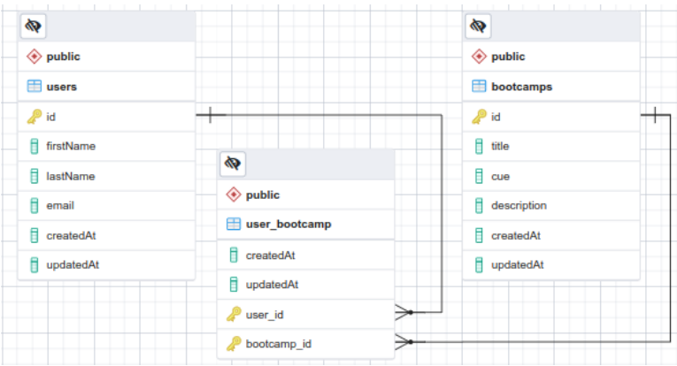

# CURSOS BOOTCAMP

Dado el siguiente modelo relacional:



## Setup del proyecto

```
npm install
```

### Compilando para desarrollo

```
npm run dev
```

## Contenido del proyecto:

### Puedes importar el respaldo de la base de datos

Lo encuentras en:

```

/public/bkp_database.sql

```

### Puedes usar las consultas precargadas e importarlas en Postman

Las encuentras en:

```

/public/consultas_postman

```

## Consultas

- Consultando el Bootcamp por id, incluyendo los usuarios.

```http

<!-- GET -->

http://localhost:3000/api/v1/bootcamp/id/1


```

- Listar todos los Bootcamp con sus usuarios.

```http

<!-- GET -->

http://localhost:3000/api/v1/bootcamp


```

- Consultar un usuario por id, incluyendo los Bootcamp.

```http

<!-- GET -->

http://localhost:3000/api/v1/user/id/1

```

- Listar los usuarios con sus Bootcamp

```http

<!-- GET -->

http://localhost:3000/api/v1/user

```

- Actualizar el usuario según su id; por ejemplo: actualizar el usuario con id=1 por Pedro Sánchez.

```http

<!-- PUT -->

http://localhost:3000/api/v1/user/id/1

```

```json
{
	"firstName": "Pedro",
	"lastName": "Sánchez",
	"email": "mateo.diaz@correo.com"
}
```

- Eliminar un usuario por id; por ejemplo: el usuario con id=1.

```http

<!-- DELETE -->

http://localhost:3000/api/v1/user/id/1

```
